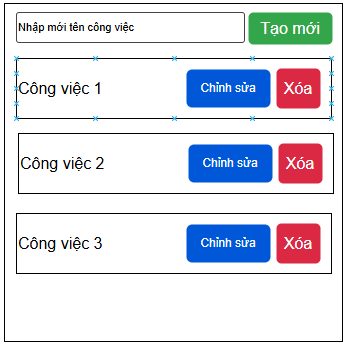
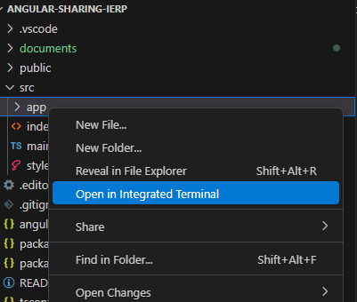
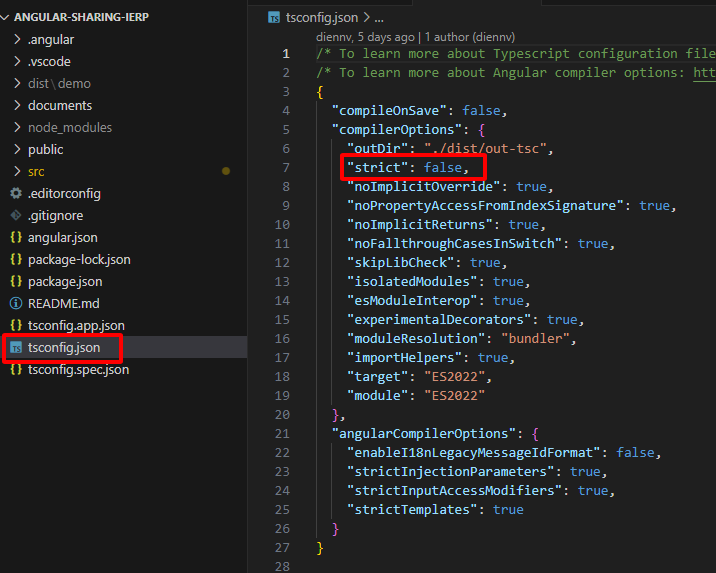
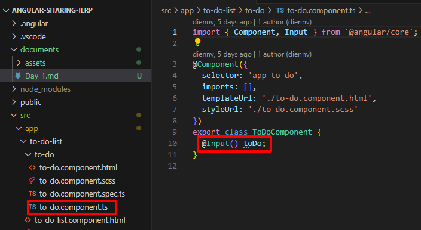
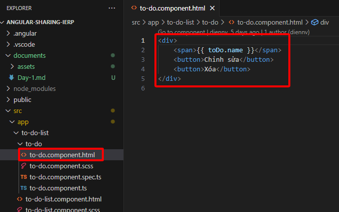
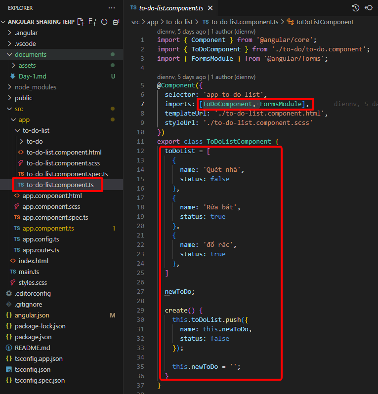
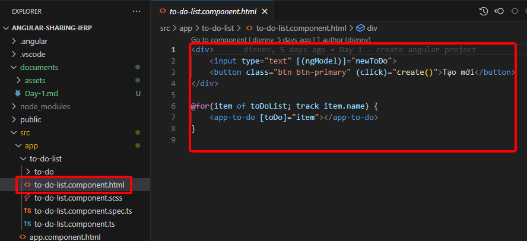
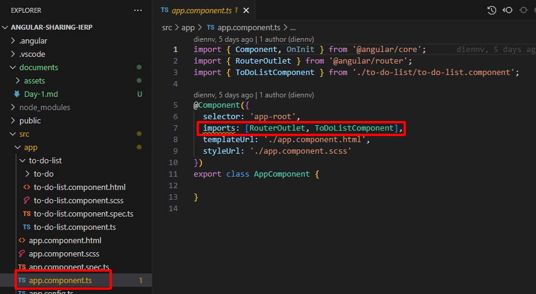
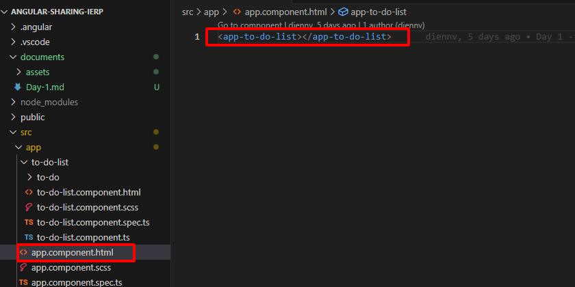
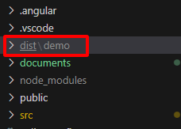

# Chia sẻ javascript và Angular
## Buổi 1: Khởi tạo dự án Angular, phát triển và build dự án
Trong buổi 1 chúng ta sẽ:
- Tìm hiểu cách khởi tạo một dự án Angular
- Xây dựng ứng dựng ToDoList
- Build ứng dụng
### **1. Cài đặt**
_1.1. Cài đặt nodejs_: [tải và cài đặt nodejs phiên bản mới nhất](https://nodejs.org/en)  
```Việc cài đặt nodejs đã bao gồm cài đặt công dụ npm (node package manager), công cụ này dùng để quản lý các thư viện, framework được sử dụng trong dự án```  
_1.2. Cài đặt visual studio code_: [tải và cài đặt visual studio code](https://code.visualstudio.com)  
_1.3. Cài đặt Angular CLI_: Angular CLI (Command Line Interface) là công cụ để tạo, chạy, build dự án.
Mở cmd hoặc terminal và chạy lệnh sau  
```npm install -g @angular/cli```
### **2. Khởi tạo dự án**
_2.1. Tạo dự án mới:_ Mở cmd hoặc terminal và chạy lệnh sau  
```ng new Demo```  
Trong đó `Demo` là tên dự án  
_2.2. Chạy dự án:_  mở cmd hoặc terminal ở trong thư mục dự án và chạy lệnh sau  
````ng serve````
### **3. Phát triển dự án**
ứng dụng ToDoList sẽ quản lý các công việc cần làm, bao gồm các chức năng: Thêm mới, sửa, xóa công việc, giao diện ứng dụng sẽ như sau   
  
_3.1. Tạo component ToDoList:_
- Mở một terminal trong visual studio code ở trong thư mục app bằng cách click chuột phải vào thư mục `app` và chọn `Open in Integrated Terminal`  
  
- Tạm thời để bỏ qua các lỗi typescript có thể gặp ta đổi thuộc tính `strict` trong file tsconfig.json về false  

- Chạy lệnh tạo component ToDoList:   `ng g c to-do-list`
- Mở terminal trong thư mục `to-do-list` và chạy lệnh tạo component ToDo: `ng g c to-do`  
```ToDoList sẽ là component cha có nhiệm vụ hiển thị danh sách công việc, ToDo sẽ là component con có nhiệm vụ hiển thị nội dung từng công việc```
- Thêm code vào các file component ToDo như sau
 - File to-do.component.ts:  

 - File to-do.component.html:  

 - File to-do-list.component.ts:  

 - File to-do-list.component.html:  

 - File app.component.ts:  

 - File app.component.ts:  

### **4. Build dự án**
Mở terminal tại thư mục root của dự án (ở trong ví dụ này là thư mục Demo) chạy lệnh  
```ng build```
Code sau khi build nằm ở thư mục dist/demo    
